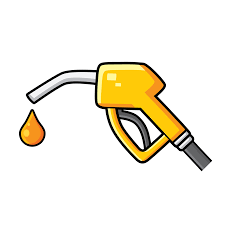

# COMP3120: Advanced Web Development
## Assignment 2: Fuel-Checker

  

### Description

Fuel-checker is a web application that keeps track of the fuel prices in the New South Wales area. Our target users are drivers or car owners in the state of New South Wales who require a one stop site to check all fuel prices. We made use of the data source provided by the [`New South Wales government`](https://api.nsw.gov.au/Product/Index/22).

The goal of this web application was to offer an alternative website for fuel tracking in the New South Wales are. We chose this goal as we found that the original fuel tracking website created by the New South Wales government wasn't created for desktop use. 

### Features 
Throughout the development of this project we were able to implement all the features we planned for the MVP of this web application. Listed in the table below are the main features we listed for the MVP and their status (Have they been achieved? Were they achieved on time?)

|Features|Status|
| --------------------------------------------- | --------------------------------------------------------------------------------------------------------------------------------------------------------------------------------------------------------------------------------------------- |
| Map & List view for Petrol Stations| Achieved on time by the allocated milestone date (Week 10).|
| User Account Creation |  Achieved on time by the allocated milestone date (Week 10). Achieved by using auth0. |
| Searching Stations by Location | Achieved on time by the allocated milestone date (Week 11). |
| Bookmark Stations | Achieved on time by the allocated milestone date (Week 11).|
| Fuel Price Graphs | Achieved on time by the allocated milestone date (Week 11). |

### Repository Structure

    ├── public        ├── favicon.ico
    ├                 ├── fuel.png
	├                 ├── header-splash.jpg
	├                 ├── index.html
	├                 ├── logo192.png
 	├                 ├── logo512.png
	├                 ├── manifest.json
	├                 └── robots.txt
	├
	├── SCREENSHOTS   ├── Wireframes
	├                 ├── DashboardPage.JPG
	├                 ├── MapPage.JPG
	├                 ├── StationsPage.JPG
	├
    ├── server        ├── controllers         ├── api.js
    ├                                         ├── appApi.js
    ├                                         ├── fuelApi.js
	├                                         └── userApi.js	
	├
    ├                 ├── models              ├── graph.js
    ├                                         ├── metrics.js
    ├                                         ├── prices.js
    ├                                         ├── stations.js
    ├                                         └── users.js
	├
	├                 ├── tests               ├── app.test.js
	├
    ├                 ├── utils               ├── middleware.js
    ├                                         └── statistics.js
	├
	├                 ├── app.js
	├                 ├── sample.json
	├                 └── server.js
    ├
    ├
    ├── src           ├── components          ├── Bookmark.js
    ├                                         ├── Dashboard.js
	├                                         ├── Dashboard.tests.js
	├                                         ├── FuelGraph.js
	├                                         ├── Map.js
	├                                         ├── MapContainer.js
	├                                         ├── MetricCard.js
	├                                         ├── Navigation.js
	├                                         ├── Pin.js
	├                                         ├── StationInfoCard.js
	├                                         ├── StationList.js
	├                                         ├── StationListItem.js
	├                                         └── StationTable.js              
    ├
    ├                 ├── pages               ├── GraphPage.js
    ├                                         └── StationInfoPage.js
    ├
	├                 ├── reducers            ├── userReducer.js
	├
	├                 ├── sass                ├── _variables.scss
    ├                                         └── App.scss
	├
	├                 ├── services            ├── price.js
    ├                                         ├── station.tests.js
	├                                         ├── station.js
	├                                         └── user.js
	├
	├                 ├── utils               ├── Helpers.js
    ├                                         └── Layers.js
	├
    ├                 ├── App.js
    ├                 ├── App.test.js
    ├                 ├── index.js
    ├                 ├── reportWebVitals.js
    ├                 ├── setupTests.js
    ├                 └── store.js
    ├             
    ├── .eslintignore
    ├── .eslintrc.js
    ├── .gitignore
	├── craco.config.js
	├── DEPLOYMENT.md
    ├── LICENSE
    ├── package.json
    ├── Procfile
    ├── README.md
    └── yarn.lock
   

### Libraries
| Package name                                  | Description                                                                                                                                                                                                                                   |
| --------------------------------------------- | --------------------------------------------------------------------------------------------------------------------------------------------------------------------------------------------------------------------------------------------- |
| [`react`](https://reactjs.org/)  | A JavaScript library for building user interfaces. |
| [`react-router-dom`](https://github.com/remix-run/react-router)     | React Library that allows for dynamic routing. |
| [`react-dom`](https://reactjs.org/docs/react-dom.html)    | A package that provides DOM-specific methods that can be used at the top level of an app. |
| [`react-bootstrap`](https://react-bootstrap.github.io/)    | Popular frontend framework. |
| [`axios`](https://axios-http.com/)    | A simple promise based HTTP client for the browser and node.js. |
| [`react-markdown`](https://github.com/remarkjs/react-markdown)    | Markdown component for React using remark. |
| [`express`](http://expressjs.com/)    | A minimal and flexible Node.js web application framework. |
| [`cors`](https://github.com/expressjs/cors)    | A node.js package for providing a Connect/Express middleware that can be used to enable CORS with various options. |
| [`auth0-react`](https://auth0.com/)    | Third-party authentication and authorization platform. |
| [`react-map-gl`](https://visgl.github.io/react-map-gl/) | A suite of components designed to provide a React API for Mapbox GL JS-compatible libraries. |
| [`react-map-gl-geocoder`](https://www.npmjs.com/package/react-map-gl-geocoder)    | React wrapper for mapbox-gl-geocoder for use with react-map-gl. |
| [`recharts`](https://recharts.org/en-US/)    | A composable charting library built on React components. |
| [`node-cron`](https://www.npmjs.com/package/node-cron)    | A tiny task scheduler in pure JavaScript for node.js based on GNU crontab. |
| [`express`](https://expressjs.com/)    | A minimal and flexible Node.js web application framework. |
| [`bcrypt`](https://www.npmjs.com/package/bcrypt)    | A library to help hash passwords. |
| [`jsonwebtoken`](https://www.npmjs.com/package/jsonwebtoken)    | An implementation of Json Web Tokens. |
| [`sass`](https://sass-lang.com/)    | A stable, and powerful professional grade CSS extension . |
| [`redux`](https://redux.js.org/)    | A predictable state container for JS Apps. |
| [`moment`](https://momentjs.com/)    | A library that parses, validate, manipulate and display dates and times in JavaScript. |
| [`supertest`](https://www.npmjs.com/package/supertest)    | A module that provides high-level abstraction for testing HTTP. |
| [`mongoose`](https://mongoosejs.com/)    | Provides a straight-forward, schema-based solution to model application data. |

### Custom Components

#### [Bookmark](src/components/Bookmark.js)

#### [FuelDropdown](src/components/FuelDropdown.js)

#### [FuelGraph](src/components/FuelGraph.js)

#### [MapContainer](src/components/MapContainer.js)

#### [MetricCard](src/components/MetricCard.js)

#### [Navigation](src/components/Navigation.js)

#### [Pin](src/components/Pin.js)

#### [StationInfoCard](src/components/StationInfoCard.js)

#### [StationList](src/components/StationList.js)

#### [StationListItem](src/components/StationListItem.js)

#### [StationTable](src/components/StationTable.js)

### Pages

#### [DashboardPage](src/components/DashboardPage.js)

#### [GraphPage](src/components/GraphPage.js)

#### [MapPage](src/components/MapPage.js)

#### [ProfilePage](src/components/ProfilePage.js)

#### [StationInfoPage](src/components/StationInfoPage.js)

### Team Members & Contributions
In our team we managed communication through regular meetings and a group chat. Using this we were able to plan and communicate about the priorities for the project and what to work on next. We also used GitHub Projects and Git Flow to manage tasks, features and general project management.

[Flynn Tesoriero - 45621365](https://github.com/Flynntes)  
As the Backend Specialist, I built out many of the routes in the API server, including the route generating GeoJSON to be ingested by the Mapbox interactive map. I also built the service that fetches data from the NSW Gov Fuel API, transforms the information and stores it in the MongoDB store. My other contributions included developing the interactive Mapbox component to display fuel stations, prices and other information. I also worked on the dashboard, station list and trends pages. 

[Nipun Shrestha - 45549192](https://github.com/nipunshrestha)
As a Data and Visulaisation Specialist, I managed the user's data state in the application using redux. I also implemented the bookmark functionality, which allowed users to save their favourite fuel stations. I was also able to design API endpoints that allowed the bookmark data to be store and collected from the database. I also added features such as search functionality and displaying bookmarks to the interactive Mapbox componenet. Lastly, I also worked on the dashboard and the profile pages. 

[Trideep Lal Das](https://github.com/TrideepLD)

[Hubert Hartan](https://github.com/HubertHartan) 

### Future of the Project
In the future, a number of new features could be added to the project. One such feature could be transforming the application into a PWA, so that users can install the application on their device and save data offline. Another potential feature that could be added to the project could be notifications, allowing users to recieve a push notification when the fuel price changes at one of their bookmarked petrol stations.
